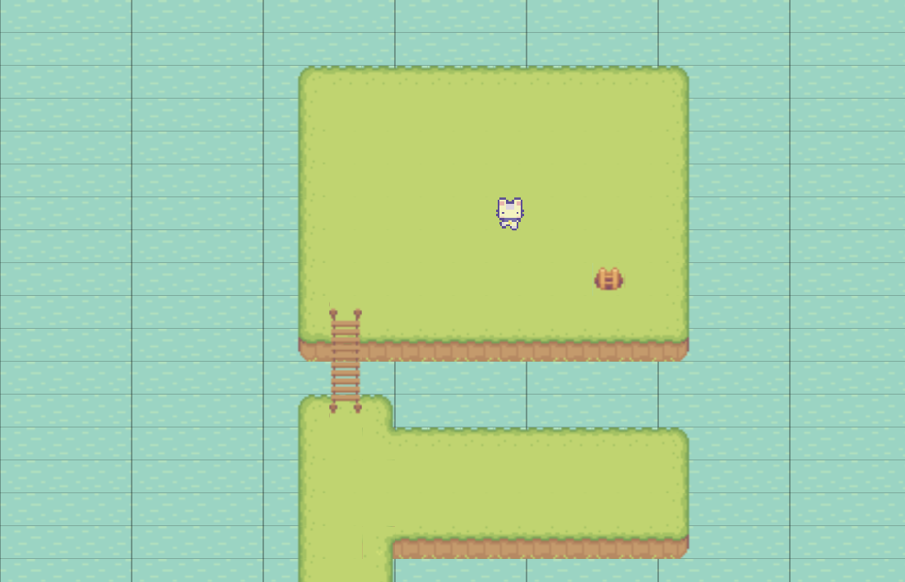
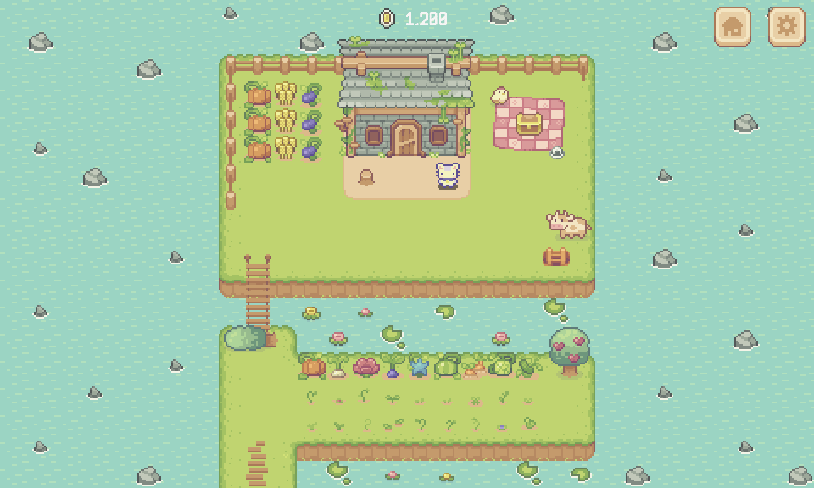
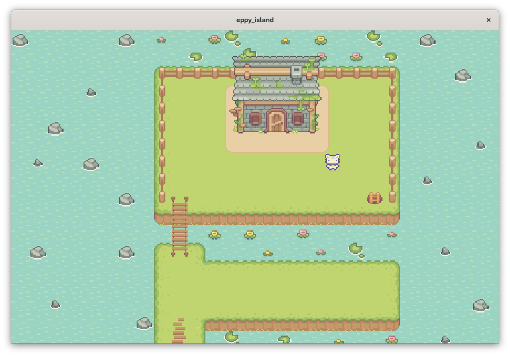
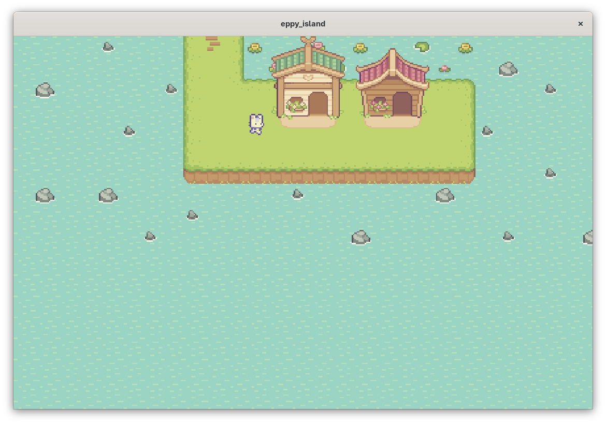
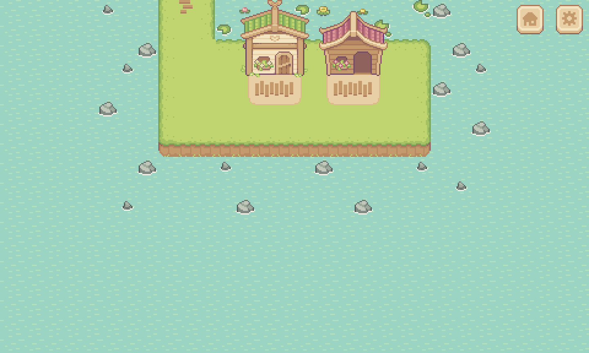

# Eppy Island

> silly game

- **Live demo:** https://aonnoes.github.io/eppy-island/
- **Demo video:**
- **Course:** Applications Development and Emerging Technologies (6ADET), Holy Angel University
- **Author:** Aaron Noel

---

## Screenshots - PERIODIC UPDATES

| Week #1 Progress | Mockup Reference |
| --- | --- |
|  |  |

| Week #2 Progress | Mockup Reference |
| --- | --- |
|  |  |
|  |  |

## Description

A silly and unserious dungeon-farming game where players venture underground to gamble against monsters, collect seeds, and bring their winnings back home. Players can buy seeds, equipment, and useful items, sell things they no longer need, and grow crops to build a stable source of income for their next ridiculous dungeon run.

- Farm Seeds — Plant seeds and grow crops to create a steady source of income.
- Enter the Dungeon — Venture underground and gamble against monsters for rewards and valuable items.
- Buy Supplies — Spend your money on seeds, equipment, and useful items from the shop.
- Sell Your Extras — Sell items you no longer need to earn extra money and keep your resources flowing.
- Build Your Income — Use your farm profits to fund more dungeon runs and keep the cycle going.

## Built with Flame

| | |
| --- | --- |
| Framework | Flutter (Dart) + Flame |
| State | Flame component state; no external state-management package |
| Storage | None currently; game data is loaded from assets/Tiled maps |
| Other packages | flame_tiled — loads and renders Tiled .tmx maps and their object layers |

## Running it yourself

Requirement: Flutter

Follow the official Flutter installation guide:
[Flutter Install Guide](https://docs.flutter.dev/install)

The game should be perfectly fine to run on any device once its done. If you want to try it out now, install Flutter on your device, clone the repository, then run the commands:

```bash
flutter pub get
flutter create
flutter run -d  chrome // linux // windows // macos
```

### Environment variables - N/A || TODO

| Variable | What it is | Where to get one |
| --- | --- | --- |
| `EXAMPLE_API_KEY` | ... | ... |

## Privacy and secret - N/A || TODO

- What personal data this app stores, if any, and where it goes.
  - The app doesn't store any personal information and it doesn't have any way to.
- Where the secrets live
  - The secrets live on my local computer and none of them leave it.
- Confirm that all sample data, screenshots and the video contain

## Project documentation - TODO

| Document | |
| --- | --- |
| [Proposal](docs/01-proposal.md) | the problem, the users, the scope |
| [Mockup and wireframes](docs/02-mockup.md) | what it looks like, and the screen flow |
| [Design system](docs/03-design-system.md) | colors, type, spacing, components |
| [Weekly reports](docs/04-weekly-reports.md) | what happened each week |
| [Demo video](docs/05-demo-video.md) | the recording and what it shows |
| [Security and privacy](docs/06-security-and-privacy.md) | the checklist, filled in |

## Status and what is next - PERIODIC UPDATES

The player moves and the framework for collisions work. The town map exists but there's no way to get there yet.

- Warps
- User Interface
- Player
  - Statistics
  - Money & Luck
- Inventory System
  - Equipments (Upgrades)
  - Items (Sellable, Ingredients, Useables)
- Shop System
  - Buying
  - Selling
- Dungeon Games
  - Rock-paper-scissors
  - Roll the dice
  - High Low
  - (more if time allows)

## Credits - PERIODIC UPDATES

- **Sprout Lands** — a simple cute 16-bit pixel art farming asset pack with animals and farming, along with farming GUI asset pack with icons, buttons, character expresions, and many other tiles in pastel colors.
  - Source: [Asset Pack](https://cupnooble.itch.io/sprout-lands-asset-pack) and [UI Expansion](https://cupnooble.itch.io/sprout-lands-ui-pack)
  - Artist: [Cup Nooble](https://itch.io/profile/cupnooble)

- **Spellthorn** — a YouTube channel that served as a major guide and reference throughout the development of Eppy's Island. Their videos were extremely helpful in learning game development concepts, workflows, and techniques, and I am genuinely very grateful for the guidance and inspiration they provided.
  - Creator: [Spellthorn](https://www.youtube.com/@Spellthorn)

- Packages: see `pubspec.yaml`

## AI use - TODO

If you used AI tools while building this, say so in a sentence or two and say
where. Honest disclosure is the standard in this course and increasingly outside
it.

## License

The source code of this project is licensed under the MIT License.
See the [LICENSE](LICENSE) file for details.

Third-party assets, including artwork, music, sound effects, fonts, and
other resources, are subject to their respective licenses and are not
necessarily covered by the MIT License.
